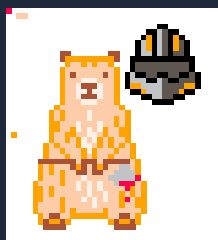

# Tekplace

The project aims to create a customized version of r/place, a collaborative platform where users can place pixels on a shared whiteboard at regular intervals. Specifically designed for Epitech students, it encourages collaboration, support, and community building within the institution. Key features include Microsoft Azure authentication using student credentials, an interactive whiteboard, and tracking of earned pixels.


## Environment Variables

To run this project, you will need to setup 4 files:
 - backend/.env
 - backend/authConfig.js
 - frontend/.env.local
 - frontend/msal/msalConfig.js

They all end with `.template`, just remove it after completing the file.

### backend/.env

`MONGODB_URI` The connection string for the MongoDB database, including the username and password for authentication.
The `MONGODB_URI` is slightly different if you run the backend inside the docker or manually.
If you run it manually it end by localhost:27017, otherwise it end by mongodb:27017.

`CLIENT_ID` The client ID used for authenticating with Microsoft Azure services.

`TENANT_ID` The Azure Active Directory tenant ID associated with your application.

`PORT` The port number on which the backend server will run.

`ADMIN_EMAIL` The email to access to admin panel (/admin).

`FRONTEND_URL` The url used by cors (can be "*")

### frontend/.env.local

`NEXT_PUBLIC_API_SCOPE` The API scope used for authentication with Microsoft services, specifying the permissions for the application.


`NEXT_PUBLIC_BACKEND_URL` The URL for the backend server, typically set to the local address during development.

`NEXT_PUBLIC_ADMIN_EMAIL` The email address of the admin user for the application, used for notifications and administrative tasks.

### backend/authConfig.js

This file configures Passport.js for authentication with Microsoft Azure Active Directory. Below is a breakdown of the configuration:

```javascript
const passportConfig = {
    credentials: {
        tenantID: "<your-tenant-id>",
        clientID: "<your-client-id>"
    },
    metadata: {
        authority: "login.microsoftonline.com",
        discovery: ".well-known/openid-configuration",
        version: "v2.0"
    },
    settings: {
        validateIssuer: true,
        passReqToCallback: true,
        loggingLevel: "info",
        loggingNoPII: true,
    },
    protectedRoutes: {
        api: {
            endpoint: "/access_as_user",
        }
    }
}

module.exports = passportConfig;
```

### frontend/msal/msalConfig.js

This file contains the configuration for Microsoft Authentication Library (MSAL), which is used for authenticating users with Microsoft Azure Active Directory.

```javascript
export const msalConfig = {
    auth: {
        clientId: '<your-client-id>',
        authority: 'https://login.microsoftonline.com/<your-tenant-id>',
        redirectUri: '<your-redirect-uri>',
    },
};

export const loginRequest = {
    scopes: ['<your-api-scope>'],
};
```
## Run (development mode)

Require `Docker`, `node v18+`

Clone the project

```bash
  git clone git@github.com:DiaboloAB/TekPlaceDev.git
```

Go to the project directory

```bash
  cd TekPlaceDev
```

Install dependencies

```bash
  ( cd frontend && npm install )
  ( cd backend && npm install )
```

Start each component in separate terminal

```bash
  ( sudo docker-compose -f docker-compose.mongodb.yml up --build )
  ( cd backend && npm run dev )
  ( cd frontend && npm run dev)
```

Go to [http://localhost:3000](http://localhost:3000)


## Deployment (final build)

Require `Docker`

Clone the project

```bash
  git clone git@github.com:DiaboloAB/TekPlaceDev.git
```

Go to the project directory

```bash
  cd TekPlaceDev
```
Start app

```bash
  sudo docker-compose up
```

Go to [http://localhost:3000](http://localhost:3000)


## Screenshots





## Appendix

 - [Microsoft Entra](https://entra.microsoft.com/)
 - [Azure-Samples](https://github.com/Azure-Samples/ms-identity-javascript-react-tutorial/tree/main)
 - [MsalWithNextJs](https://github.com/MazenSenih/MsalWithNextJs14)
 - [via-ovh-dns](https://gist.github.com/lucasdpt/062934f8c61eacd388fc01ec33cd7f93#via-ovh-dns)
## Authors

- [@DiaboloAB](https://github.com/DiaboloAB)
